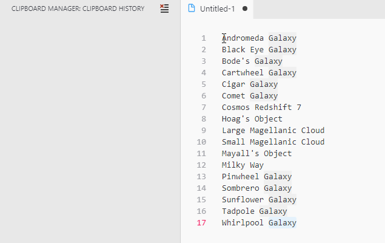

# Clipboard Manager

[](https://marketplace.visualstudio.com/items?itemName=EdgardMessias.override-decorator)
[](https://marketplace.visualstudio.com/items?itemName=EdgardMessias.override-decorator)
[](https://marketplace.visualstudio.com/items?itemName=EdgardMessias.override-decorator)

[](https://github.com/edgardmessias/vscode.override-decorator/actions)
[](https://github.com/edgardmessias/vscode.override-decorator/actions)
[](https://github.com/release-it/release-it)

[](https://david-dm.org/edgardmessias/vscode.override-decorator)
[](https://david-dm.org/edgardmessias/vscode.override-decorator?type=dev)
[](https://dependabot.com/)

[](https://codecov.io/gh/edgardmessias/vscode.override-decorator)
[](https://snyk.io/test/github/edgardmessias/vscode.override-decorator)

[](https://isitmaintained.com/project/edgardmessias/vscode.override-decorator "Average time to resolve an issue")
[](https://isitmaintained.com/project/edgardmessias/vscode.override-decorator "Percentage of issues still open")

Keep a history of your copied and cut items and re-paste, without override the `Ctrl+C` and `Ctrl+V` keyboard shortcuts.

To pick a copied item, only run `Ctrl+Shift+V`

## Features

1. Save history of all copied and cut items
1. Can check copied items outside the VSCode (`"override-decorator.onlyWindowFocused": false`)
1. Paste from history (`Ctrl+Shift+V` => Pick and Paste)
1. Preview the paste
1. Snippets to paste (Ex. `clip01, clip02, ...`)
1. Remove selected item from history
1. Clear all history
1. Open copy location
1. Double click in history view to paste

## Extension Settings

This extension contributes the following settings (default values):

<!--begin-settings-->
```js
{
  // Avoid duplicate clips in the list
  "override-decorator.avoidDuplicates": true,

  // Time in milliseconds to check changes in clipboard. Set zero to disable.
  "override-decorator.checkInterval": 500,

  // Maximum clipboard size in bytes.
  "override-decorator.maxClipboardSize": 1000000,

  // Maximum number of clips to save in clipboard
  "override-decorator.maxClips": 100,

  // Move used clip to top in the list
  "override-decorator.moveToTop": true,

  // Get clips only from VSCode
  "override-decorator.onlyWindowFocused": true,

  // View a preview while you are choosing the clip
  "override-decorator.preview": true,

  // Set location to save the clipboard file, set false to disable
  "override-decorator.saveTo": null,

  // Enable completion snippets
  "override-decorator.snippet.enabled": true,

  // Maximum number of clips to suggests in snippets (Zero for all)
  "override-decorator.snippet.max": 10,

  // Default prefix for snippets completion (clip1, clip2, ...)
  "override-decorator.snippet.prefix": "clip"
}
```
<!--end-settings-->

## Examples

Copy to history:


Pick and Paste:


