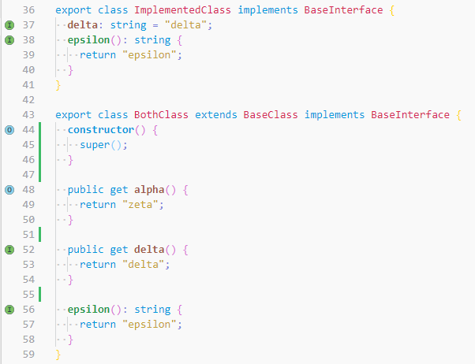

# Override Mark


Show a gutter icon when you implement/override a method/property in javascript or typescript.

## Features

1. Show a gutter icon for implemented method or property
1. Show a gutter icon for overrode method or property
1. Delay option
1. New feature are coming...

## Extension Settings

This extension contributes the following settings (default values):

<!--begin-settings-->
```js
{
  // Typescript compilerOptions
  "override-mark.compilerOptions": {},

  // The delay in milliseconds between when a change occurs and when a mark update is performed.
  "override-mark.delay": 500,

  // The style of the name of an implementing method.
  "override-mark.style.implement": "bold",

  // The style of the name of an overriding method.
  "override-mark.style.override": "bold"
}
```
<!--end-settings-->

## Examples

Override and Implement Mark:



## Development
https://code.visualstudio.com/api/working-with-extensions/publishing-extension

# Donation
* Donation is as per your goodwill to support my development.
* If you are interested in my future developments, i would really appreciate a small donation to support this project.
<table border="0">
 <tr>
    <td align="center">
    PayPal <br>
        <br>
       <a href="https://www.paypal.com/donate?hosted_button_id=5KHYY5ZDTNDSY">
          
       </a>
    </td>
    <td align="center">
       Pix (Brazil) <br>
        <br>
       28571c52-8b9b-416c-a18f-8e5246060881
    </td>
 </tr>
</table>

